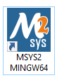

# Cach su dung msys2 de chay project remote desktop
## Luu y: su dung MSYS2 MINGW64 

## Cac lenh cai dat thu vien
 - ### pacman -Syu: cập nhật tất cả các gói MSYS2 được cài đặt lên phiên bản mới nhất

    - -S: tuỳ chọn cài đặt hoặc cập nhập gói
    - yu: tuỳ chọn cập nhat tất cả các gói, bao gồm cả các gói hệ thống và các gói do người dùng cài đặt.
- ### pacman -Su: tuỳ chọn cập nhat tất cả các gói, bao gồm cả các gói hệ thống.
  
- ### pacman -S mingw-w64-x86_64-toolchain

  - **mingw-w64-x86_64-toolchain**: cung cấp bộ công cụ phát triển cho phép bạn biên dịch và chạy các chương trình C/C++ gốc trên Windows (Uu tien su dung cai nay hon la lenh o duoi tiep theo)
      
- ### pacman -S mingw-w64-x86_64-SDL2
  - Dung de tai thu vien SDL2

- ### pacman -S mingw-w64-x86_64-SDL2_image
  - Dung de tai thu vien SDL2_image

- ### pacman -S mingw-w64-x86_64-opencv
  - Dung de tai thu vien opencv2

## Thuc hien lenh build
Cac lenh bat server chay:
 - Bat phan mem msys2
    
     
 - Vao thu muc chua file makefile, folder Net, folder server, folder obj va folder lib chua cac thu vien can thiet.
 - Go lenh "make server" va nhan enter de thuc hien build server.
 - Go lenh "./server.exe + port" de thuc hien bat server san sang cho ket noi.
   Vi du: ./server.exe 12345

Chay bat client chay:
 - Bat phan mem msys2
    
     
 - Vao thu muc chua file makefile, folder Net, folder server, folder obj, folder bin va folder lib chua cac thu vien can thiet.
 - Go lenh "make" va nhan enter de thuc hien build client.
 - Go lenh "./bin/client.exe" de thuc hien bat client de ket noi voi cac may.
